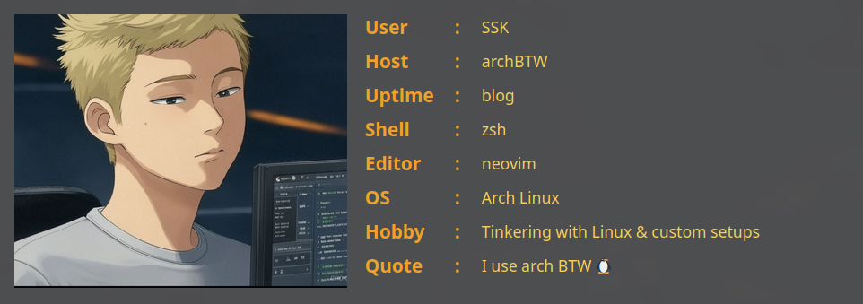

## 

# 🔥 Neofetch:

## 

# 📊 GitHub Stats:

---

# 💻 Tech Stack:

**_Programming Languages_**

       

---

**Frameworks**

      

---

**Databases**

   

---

**DevOps & Deployment**

    

---

**Package Managers & Build Tools**

   

---

**Tools**

 

---
